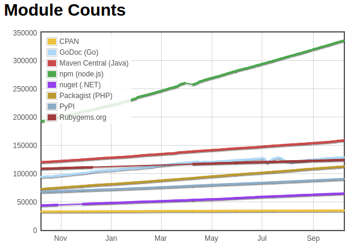
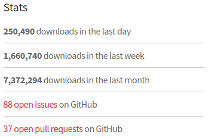

# Secure Dependency Management

Node.js, being modular in nature, inherently makes projects heavily dependent on external libraries. Having external dependencies in your project is not a bad thing per say, but it requires a great deal of attention and awareness as you may be subject to vulnerabilities that are introduced by those external libraries.

I> ## On dependencies
I> Some projects are small that they truly require no dependency, others may require just a few, yet is is almost impossible in these days of the "JavaScript Fatigue" state to not rely on external dependencies, even those that are required to build and develop the project.

3rd Party dependencies are not unique to Node.js. In fact, other platforms and languages like Java, Ruby, PHP and Python promote a modular architecture and heavily rely on community or commercial libraries to build projects.

Node.js packages are hosted and managed by a project called [npm](https://www.npmjs.com/), which became the biggest package repository already in 2014. The current state of packages count is illustrated thanks to [modulecounts](http://www.modulecounts.com/) where it is compared with other platform and languages, true to end of 2016 year:



T> ## npm stands for...
T> Actually, npm is not an abbreviation for 'node package manager' as some people tend to presume. It isn't an abbreviation for anything, it's just npm.

## Evaluating Dependencies

Understanding your dependency tree, and your dependencies dependencies is a vital action that needs careful review to ensure that the libraries you intend to use are mature, and of high quality.

When we reviewed the libraries in this book we presented the project's badges to present the maturity and quality level of the project. With the plethora of Node.js packages, it's easy to mistaken pick an outdated, unmaintained or otherwise low quality project.

Taking [ExpressJS](https://www.npmjs.com/package/express) project as an example, let's review the npm pacakge page for it which reveals useful information and can help to evaluate a package https://www.npmjs.com/package/express.

### Project Activity

A general project activity shows information about the maintainers and collaborators, it's last releases and a quick link to the GitHub project page:


### Project Statistics

Curious about the project's popularity can be settled by reviewing the download statistics for ExpressJS, which also features numbers it pulls from GitHub with regards to open issues, and open pull requests:



### Project Dependencies

The project's own dependencies are listed, as well as other npm packages which depend upon the ExpressJS library itself (which is a bigger count than possible to git in the picture below):


## Dependency Tracking

External dependencies add the overhead of tracking the security of 3rd party libraries that are part of your project. We'll review several tools and techniques to keep track of the security status for your project dependencies.

T> ## A Project's Dependencies
T> For Node.js projects, dependencies split between your project's primary dependencies which are found in the `dependencies` property in the `package.json` file, as well as the dependencies required to build, develop and maintain the project, and are found in the `devDependencies` property. It is essential to track both and confirm none introduce a security vulnerability.

### Node Security: nsp

[nsp](https://www.npmjs.com/package/nsp) is a command-line tool that helps track the security of project dependencies by detecting if they are subject to known vulnerabilities. It is one of the first Node.js tools in the information security eco-system from the company [^lift security](https://liftsecurity.io/), which have been actively involved in Node.js and security in specific.

nsp builds it's database of vulnerabilities based on [NIST National Vulnerability Database](https://nvd.nist.gov/) as well as it's own repository of [advisories](https://nodesecurity.io/advisories). It scans project dependencies based on the `package.json` file to compare versions of the installed libraries with known vulnerable versions based on the aforementioned databases.

It is customary to install nsp as a global module so it can be used in multiple projects:

```bash
npm install -g nsp
```

Running a security check for an existing Node.js project:

```bash
nsp check
```

A real output of a scan will look something like the following:


In the above report nsp detected a security issue in the meanjs project. The dependency `grunt-cli` introduces a vulnerable package called `minimatch`. It is required to upgrade to a newer version of `grunt-cli` to receive an updated, patched version of `minimatch` as well (this is not guaranteed though).

T> ## Report output
T> nsp supports different types of reporting output such as a summary, json output and others so it can be easily integrated with other automation and build tools if necessary.

nsp has grown beyond a command-line tool and is part of an ecosystem and cloud offering called [Node Security Platform](https://nodesecurity.io/) that integrates with GitHub public or private repositories to track them and their pull-requests and ensure no insecure dependencies are being introduced to the project.

### Snyk

Snyk VulnDB based off of nsp's advisories database as well as snyk's own database

minimatch is not a direct dependency of the meanjs project, and not even for `grunt-cli` as can be seen in the `path` field of the report, so a patch must be provided to one of the

## NPM Shrinkwrap

When publishing packages to npm, it is required to maintain [semantic versioning](https://docs.npmjs.com/misc/semver) which is a program version [specification](http://semver.org/) that defines how to properly version software releases.

In short, a version can and should be described by three identifiers: a major, a minor, and a patch. For example: 1.2.0. Keeping with the semver rules, a bug fix applied to a release should increment the patch version to 1.2.1. If a breaking API change occurred during a release then the major version should be incremented, thus resulting in a new version say 2.0.0.

When installing packages, npm automatically applies a range operator. This results in the `package.json` file having entries such as:

```json
{
  "dependencies": {
    "library1": "~2.0.0",
    "library2": "^3.0.0"
  }
}
```

These tilde and caret operators define a version range for npm to look for new packages. If there is a new 2.0.1 release of *library1* then invoking an `npm install` will update the currently installed version to 2.0.1. For *library2* this is true as well, if a new 3.5.0 is released as well.

T> ## Interactive Version Calculator
T> npm hosts a website to easily visualize and understand how semantic versions work for real packages: [https://semver.npmjs.com](https://semver.npmjs.com).

### The Risk

With this understanding of semantic versioning, it is clear that the external libraries we use in our project can rapidly change and introduce risks which are both functional issues such as breaking features, or a new bug, as well as new security vulnerabilities.

This is commonly referred to as a **drifting dependencies** problem, and happens quite often.

### The Solution

One simple solution to this problem is to configure npm that upon installing packages it should use a specific range operator that suits your policy, or simply match the exact version that is currently being installed.

This can be achieved from the command-line as well:

```shell
npm install expressjs --save-exact
```

Another, more standard approach to pinning down package versions is to make use of the shrinkwrap option that npm provides.

To prevent npm from recursively updating nested dependencies, a shrinkwrap creates a map of all installed dependencies, and their dependencies and pins down the exact package versions for the entire dependency tree.

Generating an npm shrinkwrap for a project:

```shell
npm shrinkwrap
```

The outcome is a JSON file `npm-shrinkwrap.json` which npm will always consult when triggered and follow the package versions for it when installing missing packages. For new packages being installed, it will also update this shrinkwrap file with the exact version to pin it down.


## Summary
