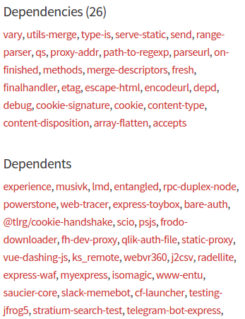
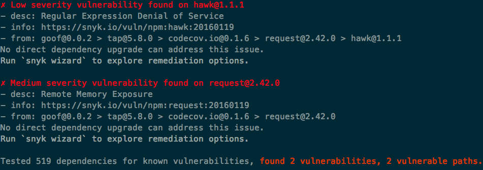
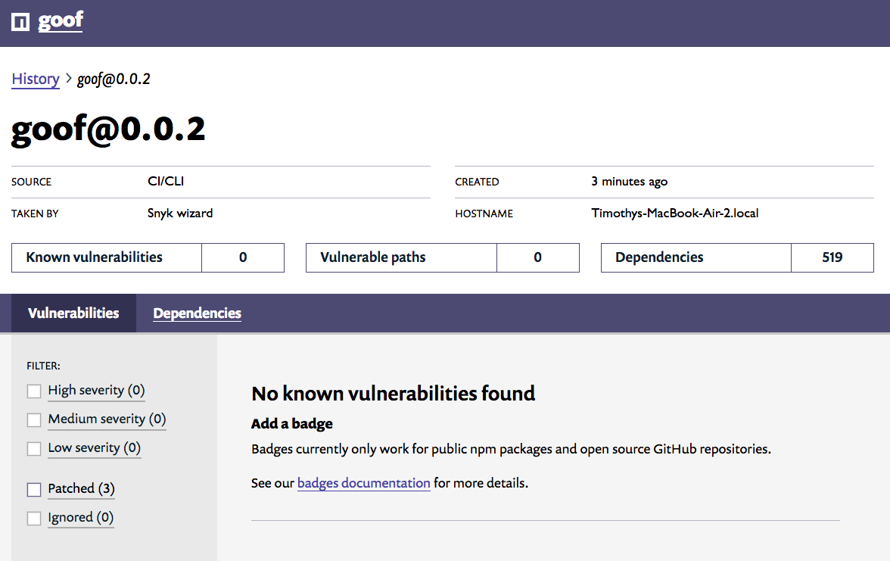
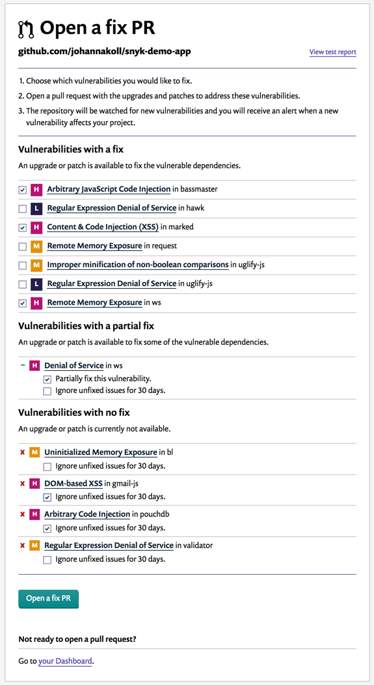

# Secure Dependency Management

Node.js, being modular in nature, inherently makes projects heavily dependent on external libraries. Having external dependencies in your project is not a bad thing per say, but it requires a great deal of attention and awareness as you may be subject to vulnerabilities that are introduced by those external libraries.

I> ## On dependencies
I> Some projects are small that they truly require no dependency, others may require just a few, yet is is almost impossible in these days of the "JavaScript Fatigue" state to not rely on external dependencies, even those that are required to build and develop the project.

3rd Party dependencies are not unique to Node.js. In fact, other platforms and languages like Java, Ruby, PHP and Python promote a modular architecture and heavily rely on community or commercial libraries to build projects.

Node.js packages are hosted and managed by a project called [npm](https://www.npmjs.com/), which became the biggest package repository already in 2014. The current state of packages count is illustrated thanks to [modulecounts](http://www.modulecounts.com/) where it is compared with other platform and languages, true to end of 2016 year:


T> ## npm stands for...
T> Actually, npm is not an abbreviation for 'node package manager' as some people tend to presume. It isn't an abbreviation for anything, it's just npm.

## Evaluating Dependencies

Understanding your dependency tree, and your dependencies dependencies is a vital action that needs careful review to ensure that the libraries you intend to use are mature, and of high quality.

When we reviewed the libraries in this book we presented the project's badges to present the maturity and quality level of the project. With the plethora of Node.js packages, it's easy to mistaken pick an outdated, un-maintained or otherwise low quality project.

Taking [ExpressJS](https://www.npmjs.com/package/express) project as an example, let's review the npm package page for it which reveals useful information and can help to evaluate a package https://www.npmjs.com/package/express.

### Project Activity

A general project activity shows information about the maintainers and collaborators, it's last releases and a quick link to the GitHub project page:


### Project Statistics

Curious about the project's popularity can be settled by reviewing the download statistics for ExpressJS, which also features numbers it pulls from GitHub with regards to open issues, and open pull requests:


### Project Dependencies

The project's own dependencies are listed, as well as other npm packages which depend upon the ExpressJS library itself (which is a bigger count than possible to git in the picture below):



## Dependency Tracking

External dependencies add the overhead of tracking the security of 3rd party libraries that are part of your project. We'll review several tools and techniques to keep track of the security status for your project dependencies.

T> ## A Project's Dependencies
T> For Node.js projects, dependencies split between your project's primary dependencies which are found in the `dependencies` property in the `package.json` file, as well as the dependencies required to build, develop and maintain the project, and are found in the `devDependencies` property. It is essential to track both and confirm none introduce a security vulnerability.

### Node Security: nsp

[nsp](https://www.npmjs.com/package/nsp) is a command-line tool that helps track the security of project dependencies by detecting if they are subject to known vulnerabilities. It is one of the first Node.js tools in the information security eco-system from the company [^lift security](https://liftsecurity.io/), which have been actively involved in Node.js and security in specific.

nsp builds it's database of vulnerabilities based on [NIST National Vulnerability Database](https://nvd.nist.gov/) as well as it's own repository of [advisories](https://nodesecurity.io/advisories). It scans project dependencies based on the `package.json` file to compare versions of the installed libraries with known vulnerable versions based on the aforementioned databases.

It is customary to install nsp as a global module so it can be used in multiple projects:

```bash
npm install -g nsp
```

Running a security check for an existing Node.js project:

```bash
nsp check
```

A real output of a scan will look something like the following:


In the above report nsp detected a security issue in the [MEAN.JS](https://gitter.im/meanjs/mean) project. The dependency `grunt-cli` introduces a vulnerable package called `minimatch`. It is required to upgrade to a newer version of `grunt-cli` to receive an updated, patched version of `minimatch` as well (this is not guaranteed though).

T> ## Report output
T> nsp supports different types of reporting output such as a summary, json output and others so it can be easily integrated with other automation and build tools if necessary.

nsp has grown beyond a command-line tool and is part of an ecosystem and cloud offering called [Node Security Platform](https://nodesecurity.io/) that integrates with GitHub public or private repositories to track them and their pull-requests and ensure no insecure dependencies are being introduced to the project.

### Snyk
[Snyk](https://snyk.io) is a service for continuously monitoring your project's dependencies for any known vulnerabilities. Snyk provides a command-line interface, as well as a robust GitHub integration that can further simplify the process.

Snyk tests dependencies against their [open-source vulnerability database](https://snyk.io/vuln/), and has dedicated researchers actively discovering new vulnerabilities to be disclosed. Similar to nsp (Node Security Platform), Snyk's GitHub integration scans a projects `package.json` to see what versions of dependencies are currently installed, and compares those versions to their database. The command-line interface goes a step further and scans the installed packages themselves.

To use the command-line interface, you first install Snyk as a global module:

```bash
npm install -g snyk
```

With the Snyk tool installed, you can test your project for vulnerabilities using the `snyk test` command:

```bash
snyk test
```

Snyk will test your installed packages against their vulnerability database and output something like the following:



In this example, you can see that Snyk found two vulnerabilities. For each vulnerability, Snyk provides information about the severity, a link to a detailed description, and the path through which the vulnerable package got into your system.

Snyk also prompts you to run `snyk wizard` which will walk you through the process of fixing those vulnerabilities. Before you do that, you'll want to authenticate using the authorization token you receive when you first sign up for the service. This ensures you won't run into any API rate limits, and also enables you to setup continuous monitoring, which we'll talk about shortly.

```bash
snyk auth <your token>
```

Now authorized, you can run the wizard to help you fix the issues Snyk found.

```bash
snyk wizard
```

The wizard will once again test your packages for vulnerabilities. For each vulnerability, you'll be prompted with all the same information you received when you ran `snyk test`. You'll also be provided with remediation options, like so:


In the above example, you can see that for Snyk is providing a few options for how to address the low severity vulnerability found in the `hawk` package, which in turn was introduced via the `tap` package. The basic options are to:

- Upgrade the package to a version where the vulnerability has been fixed. In this case, there is no upgrade that address the issue, which Snyk notes.
- Patch the issue, which modifies the actual files locally on your machine.
- Ignore the issue for 30 days, which will ensure that Snyk won't alert you to this vulnerability in subsequent tests until that 30 days has passed.
- Skip the issue altogether. If you choose to skip, Snyk will still report this issue each time it is run.

Once you've walked through the wizard for each discovered vulnerability, Snyk will apply any patches and upgrades you've selected (modifying `package.json` and running `npm update` as needed) and store your decisions in `.snyk` policy file that it will refer to whenever you run Snyk on that project in the future.

Since you've authenticated, a snapshot of the current state of your dependencies will also be stored to your account.



This enables Snyk to notify you (using email or Slack) whenever a newly discovered vulnerability impacts your project, letting you address the issue immediately.

As part of the `wizard` process, Snyk will also optionally integrate some tests and protection steps into your `package.json` file. If you decide, you can:

- Have Snyk add `snyk test` to the `test` script, which will query local dependencies for vulnerabilities and throw an error if any are found.
- Have Snyk add `snyk protect` to your project as a `post-install` step. This way if you publish the module, Snyk can apply any patches you've selected each time the module is installed.

Snyk's command-line interface is great for integrating into your continuous integration systems, but an even more automated process is provided if your application is contained in a GitHub repository.

When you login to your Snyk account, there is a button allowing you to test your GitHub repositories. After you provide Snyk GitHub permissions, Snyk will automatically test these repos and provide the test results in an abbreviate form.


You can see in the screenshot above that for each repository, Snyk will tell you the number of high, medium and low priority vulnerabilities, as well as give you the option to "Watch" the repository. Selecting this will add the repository as a project to Snyk so that Snyk can continuously check it against any newly disclosed vulnerabilities.

You also have the option to "Open a fix PR". This will take you to a page where you can review the suggested remediation and create an automated pull request to your project with the required upgrades and patches.



The Snyk service is free for any open-source projects, with different tiers available for private projects depending on the functionality you need.

## NPM Shrinkwrap

When publishing packages to npm, it is required to maintain [semantic versioning](https://docs.npmjs.com/misc/semver) which is a program version [specification](http://semver.org/) that defines how to properly version software releases.

In short, a version can and should be described by three identifiers: a major, a minor, and a patch. For example: 1.2.0. Keeping with the semver rules, a bug fix applied to a release should increment the patch version to 1.2.1. If a breaking API change occurred during a release then the major version should be incremented, thus resulting in a new version say 2.0.0.

When installing packages, npm automatically applies a range operator. This results in the `package.json` file having entries such as:

```json
{
  "dependencies": {
    "library1": "~2.0.0",
    "library2": "^3.0.0"
  }
}
```

These tilde and caret operators define a version range for npm to look for new packages. If there is a new 2.0.1 release of *library1* then invoking an `npm install` will update the currently installed version to 2.0.1. For *library2* this is true as well, if a new 3.5.0 is released as well.

T> ## Interactive Version Calculator
T> npm hosts a website to easily visualize and understand how semantic versions work for real packages: [https://semver.npmjs.com](https://semver.npmjs.com).

### The Risk

With this understanding of semantic versioning, it is clear that the external libraries we use in our project can rapidly change and introduce risks which are both functional issues such as breaking features, or a new bug, as well as new security vulnerabilities.

This is commonly referred to as a **drifting dependencies** problem, and happens quite often.

### The Solution

One simple solution to this problem is to configure npm that upon installing packages it should use a specific range operator that suits your policy, or simply match the exact version that is currently being installed.

This can be achieved from the command-line as well:

```shell
npm install expressjs --save-exact
```

Another, more standard approach to pinning down package versions is to make use of the shrinkwrap option that npm provides.

To prevent npm from recursively updating nested dependencies, a shrinkwrap creates a map of all installed dependencies, and their dependencies and pins down the exact package versions for the entire dependency tree.

Generating an npm shrinkwrap for a project:

```shell
npm shrinkwrap
```

The outcome is a JSON file `npm-shrinkwrap.json` which npm will always consult when triggered and follow the package versions for it when installing missing packages. For new packages being installed, it will also update this shrinkwrap file with the exact version to pin it down.

## Yarn as npm Package Management

[Yarn](https://yarnpkg.com) is a package management client tool for the command line which serves as an alternative to the ubiquitous `npm` tool.

It's originated from Facebook with the purpose of replacing the `npm` client tool in order to provide reliable package resolution, and fast installs, as is required with the likes of Facebook's scale.

Yarn's advantage can be characterized by the following:

 * Reliability and Speed
 * Deterministic Package Resolution
 * Security

### Reliability and Speed

When Yarn downloads packages it always saves them to a local directory so they can be cached
locally for offline use. This inherently speeds up the `yarn install` action as there is no
bandwidth wasted and one can witness a significantly increased speed when installing modules.

Another optimization step that Yarn is performing is to download packages in parallel rather than serially, one after the other.

T> ## cache for offline
T> Caching packages means you're easily able to get them when working offline. To find out where exactly Yarn saves them run: `yarn cache dir`

### Deterministic Package Resolution 

When installing packages using the `npm` client, it will resolve versions of dependencies in
real time. We learned how to handle this problem of drifting dependencies using the
`npm-shrinkwrap.json` methodology. However, the shrinkwrap file has been noted to be
problematic in maintaining the dependency graph and reliably resolving pinned version.

This is where Yarn's method of resolving packages has been improved to become truly deterministic in always resolving to the same version. Yarn generates and maintains it's own `yarn.lock` file and you aren't expected nor shouldn't be editing it manually. This file is expected to be commited to your code repository so it can be shared with the rest of the team and assure everyone are using the same version of packages across developers, test, and production environments.

### Security

Yarn provides security by the means of integrity checking the packages it installs.

When Yarn installs packages it records a SHA1 checksum of the file it downloaded as part of the package information in it's `yarn.lock` file.

While this is not a means of complete security, it provides safety and validation mechanism where if a man-in-the-middle would be tempering with the packages in transit to send a modified version of the package then Yarn will catch it by noticing the checksum change.


### Command Line Usage  

It's command line interface is also more restrictive for minimizing human errors. For example, if you were to install the `helmet` library with npm, it would be possible to easily mistake and install it in the local `node_modules/` directory without adding it as a dependency to your project through `package.json`. Such as:
  
```bash
npm install helmet
```

With Yarn, it is impossible to just install a floating module on the project, and the defaults are safe enough to always add your installed module to `package.json` so you never accidentally push code without the modules it depends on.

#### Installing Yarn

Yarn can be installed using a variety of options, the easiest of them is using the `npm` tool itself:

```bash
npm install -g yarn
```

I> Other recommended alternative installation methods include the `brew`, and `curl` tools
I> and are documented here: https://yarnpkg.com/en/docs/install  

#### Tracking Dependencies with Yarn

```bash
yarn outdated
```


## Summary

Keeping track of your project's dependency tree is of high importance in order of making sure no vulnerabilities are introduced through 3rd party libraries.

We reviewed a set of tools and techniques to help track them:

* Snyk project is helpful in keeping track of vulnerabilities introduced through your module dependencies, and provides a way to patch your dependencies even if no fix is yet available for them.

* Node Security Platform (nsp) is another useful tool to check for vulnerabilities in 3rd party modules.

* Npm's shrinkwrap method will lock your module dependencies to a specific known version.

* Yarn package manager helps in assuring expected version dependencies 

{pagebreak}
